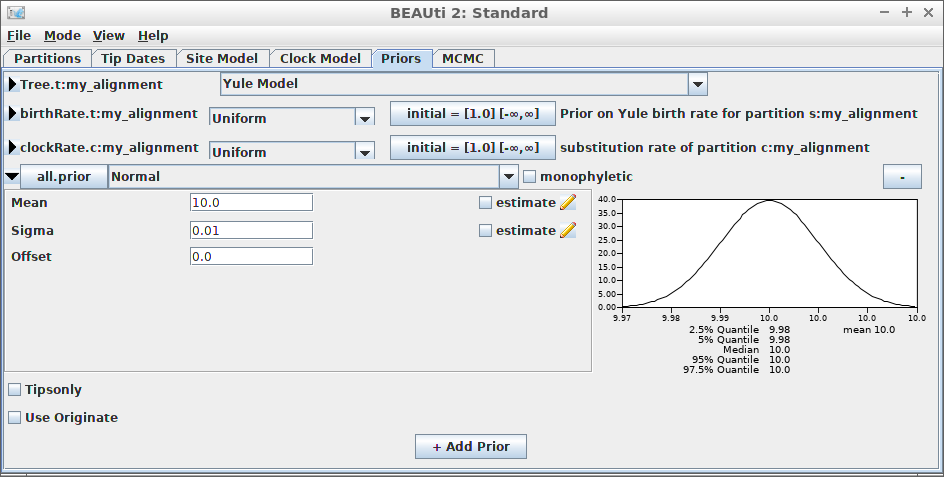

```{r setup, include = FALSE}
knitr::opts_chunk$set(
  collapse = TRUE,
  comment = ""
)
```

# Introduction


The purpose of `beautier` is to create a valid `BEAST2` XML input file
from its function argument. In this way, a scientific pipeline using 
`BEAST2` can be fully scripted, instead of using `BEAUti`'s GUI.

`beautier` is part of the `babette` package suite (website at [https://github.com/ropensci/babette](https://github.com/ropensci/babette)). 
`babette` allows to use BEAST2 (and its tools) from R.

# Getting started

For all examples, do load `beautier`:

```{r load_beautier}
library(beautier)
```

Each example shows a picture of a BEAUti dialog to achieve the same.
BEAUti is part of the BEAST2 tool suite and it's a GUI to create BEAST2
input files. `beautier` is an R package to supplement BEAUti, by providing
to do the same from an R script.

Each example reads the alignment from a FASTA file called `anthus_aco_sub.fas`,
which is part of the files supplied with `beautier`:

```{r show_input_file}
input_filename <- get_beautier_path("anthus_aco_sub.fas")
```

In this vignette, the generated BEAST2 XML is shown.
Use `create_beast2_input_file` to save the resulting
XML directly to file instead.

## Example #1: all default


Using all default settings, only specify a DNA alignment.

```{r example_1}
create_beast2_input(
  input_filename
)
```

All other parameters are set to their defaults, as in BEAUti.

## Example #2: JC69 site model


```{r example_2}
create_beast2_input(
  input_filename,
  site_model = create_jc69_site_model()
)
```

## Example #3: Relaxed clock log normal


```{r example_3}
create_beast2_input(
  input_filename,
  clock_model = create_rln_clock_model()
)
```

## Example #4: Birth-Death tree prior


```{r example_4}
create_beast2_input(
  input_filename,
  tree_prior = create_bd_tree_prior() 
)
```

## Example #5: Yule tree prior with a normally distributed birth rate


```{r example_5}
create_beast2_input(
  input_filename,
  tree_prior = create_yule_tree_prior(
    birth_rate_distr = create_normal_distr()
  ) 
)
```

Thanks to Yacine Ben Chehida for this use case

## Example #6: HKY site model with a non-zero proportion of invariants


```{r example_6}
create_beast2_input(
  input_filename,
  site_model = create_hky_site_model(
    gamma_site_model = create_gamma_site_model(prop_invariant = 0.5)
  )
)
```

Thanks to Yacine Ben Chehida for this use case

## Example #7: Strict clock with a known clock rate


```{r example_7}
create_beast2_input(
  input_filename,
  clock_model = create_strict_clock_model(
    clock_rate_param = 0.5
  ) 
)
```

Thanks to Paul van Els and Yacine Ben Chehida for this use case.

## Example #8: Use MRCA prior


```{r example_8}
create_beast2_input(
  input_filename,
  mrca_prior = create_mrca_prior()
)
```

## Example #9: Use MRCA prior to specify a close-to-fixed crown age



With an MRCA  prior, it is possible
to specify a close-to-fixed crown age:

```{r example_9}
crown_age <- 15

create_beast2_input(
  input_filename,
  mrca_prior = create_mrca_prior(
    is_monophyletic = TRUE,
    mrca_distr = create_normal_distr(
      mean = crown_age,
      sigma = 0.001
    )
  )
)
```
